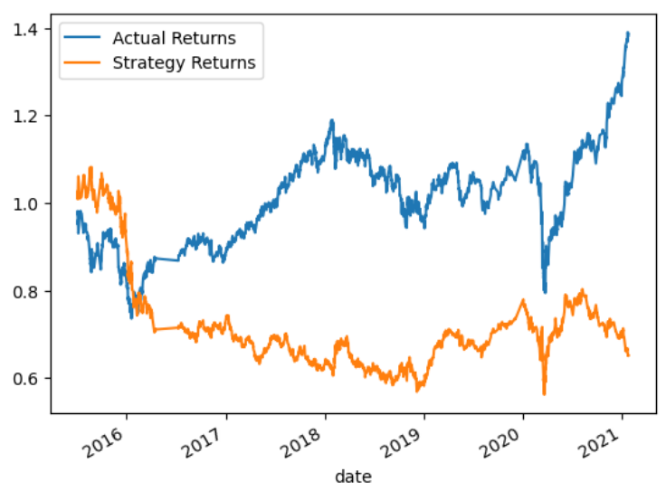
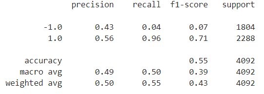
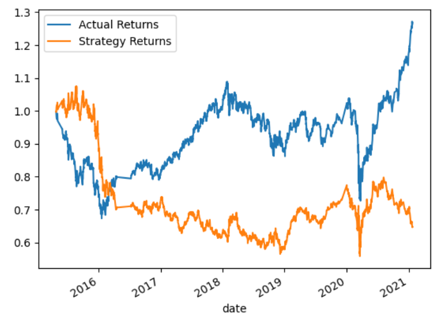
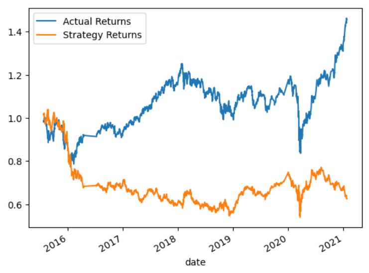
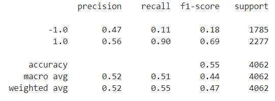

# Machine Learning Trading Bot

This project creates a trading algorithm and established a baseline performance for it. Then we use SKLearn's support vector machine (SVM) learning method to fit the training data and make predictions based on the testing data, and review the predictions on its classification report.

Afterwards, we adjust the model’s input features to find parameters that result in better trading outcomes (SMA, training data size, etc), and also try a different model with a new SKLearn's classifier.

Finally, we compare both classification reports and trading performances.

---

## Technologies

The whole project is implemented in Python, writen in Jupyter lab using the Pandas and Numpy libraries: 

* ```import pandas as pd```
* ```import numpy as np```
* ```import hvplot.pandas```
* ```import matplotlib.pyplot as plt```
* ```from pathlib import Path```
* ```from pandas.tseries.offsets import DateOffset```

We use scikit-learn’s `StandardScaler()` to preprocess and scale the dataset, and the classification report for analysis and comparison.

* ```from sklearn.preprocessing import StandardScaler```
* ```from sklearn.metrics import classification_report```

And also SKLearn's support vector machine (SVM) and Logistic Regression classifiers:

* ```from sklearn.linear_model import LogisticRegression```
* ```from sklearn.svm import SVC```

---

## Conclusions

Performance for the **Baseline Trading Algorithm**:




In this case, the model appears to have low precision and recall for the negative class (-1.0), with a precision of only 0.43 and recall of 0.04. This means that the model has a high number of false positives and low true negatives. However, it has a high precision and recall for the positive class (1.0), with a precision of 0.56 and recall of 0.96, indicating that the model performs well in predicting positive values. The weighted average F1-score is 0.43, which is relatively low, and the accuracy of the model is 0.55, indicating that the model does not perform well overall.
Then we tune, or adjust, the model’s input features to find the parameters that result in the best trading outcomes. 

1. **First, we adjust the SMA inputs features**. By reducing the SMA window (from short-long 4-100 to 1-10) the cumulative return of the strategy has improved slightly. When decreasing the SMA window, the indicator becomes more responsive to price changes and provides signals more quickly. This is because the SMA will be based on fewer past price values, which increases the impact of recent price fluctuations on the indicator. However, decreasing the SMA window may also increase the noise in the indicator and result in more false signals, as it becomes more sensitive to short-term price fluctuations.



2. **Second, we increase the size of the training set by increasing the training window from 3 to 6 months**. Increasing the ending period for the training data with an offset of 6 months could improve the results because it allows the model to learn from more recent data, which may better reflect the current market conditions. In finance, market conditions can change rapidly and dramatically, and using more recent data can help the model capture these changes and adapt to them. By including an additional 3 months of training data, the model has access to more information about recent trends and patterns in the data. This can help the model identify new patterns and relationships that it may have missed with less data. Additionally, including more recent data can help the model reduce the impact of outdated data on its prediction.




Finally, running a LogisticRegression Classifier instead of the SVM, and comparing both classification reports, we conclude: 

**SVM and Original Data**  


**Logistic Regression and Adjusted Data**  



Looking at the two classification reports, we can see that the second one has slightly better precision and recall scores for both classes compared to the first report. In the second report, precision and recall for the -1.0 class are higher, which means that the model is doing a better job at identifying negative cases. For the 1.0 class, the precision score is the same, but the recall score is higher, which means that the model is doing a better job at identifying positive cases. Overall, the second report has better F1 scores, which is a balance between precision and recall, and is therefore a better report than the first one.

---

## Contributors

Feature developed by Lourdes Dominguez [(LinkedIn profile)](https://www.linkedin.com/in/lourdes-dominguez-bengoa-12333044/)

---

## License

Use only for academic purposes.