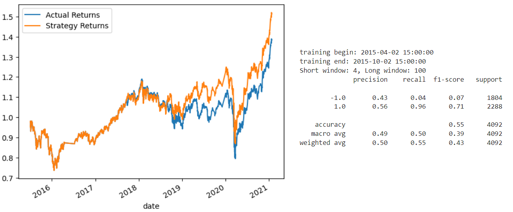
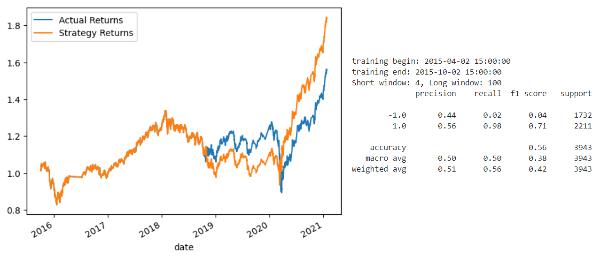
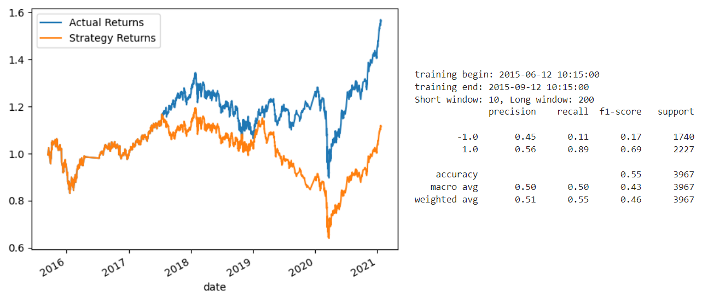
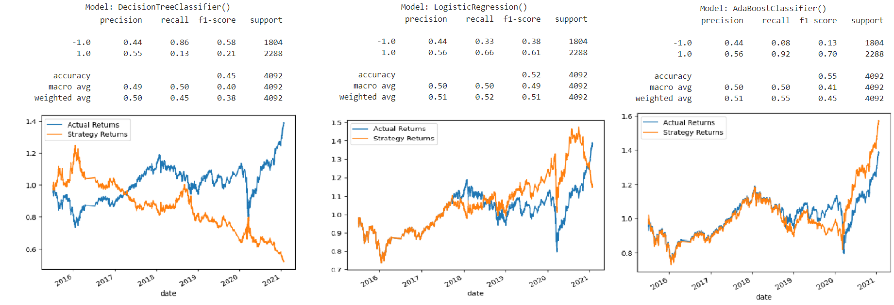

# Machine Learning Trading Bot

This project creates a trading algorithm and established a baseline performance for it. Then we use SKLearn's support vector machine (SVM) learning method to fit the training data and make predictions based on the testing data, and review the predictions on its classification report.

Afterwards, we adjust the model’s input features to find parameters that result in better trading outcomes (SMA, training data size, etc), and also try a different model with a new SKLearn's classifier.

Finally, we compare both classification reports and trading performances.

---

## Technologies

The whole project is implemented in Python, writen in Jupyter lab using the Pandas and Numpy libraries: 

* ```import pandas as pd```
* ```import numpy as np```
* ```import hvplot.pandas```
* ```import matplotlib.pyplot as plt```
* ```from pathlib import Path```
* ```from pandas.tseries.offsets import DateOffset```

We use scikit-learn’s `StandardScaler()` to preprocess and scale the dataset, and the classification report for analysis and comparison.

* ```from sklearn.preprocessing import StandardScaler```
* ```from sklearn.metrics import classification_report```

And also SKLearn's support vector machine (SVM) and Logistic Regression classifiers:

* ```from sklearn.linear_model import LogisticRegression```
* ```from sklearn.svm import SVC```

---

## Conclusions

Performance for the **Baseline Trading Algorithm**:



In this case, the model appears to have low precision and recall for the negative class (-1.0), with a precision of only 0.43 and recall of 0.04. This means that the model has a high number of false positives and low true negatives. However, it has a high precision and recall for the positive class (1.0), with a precision of 0.56 and recall of 0.96, indicating that the model performs well in predicting positive values. The weighted average F1-score is 0.43, which is relatively low, and the accuracy of the model is 0.55, indicating that the model does not perform well overall.
Then we tune, or adjust, the model’s input features to find the parameters that result in the best trading outcomes. 

1. **First, we increase the size of the training set by increasing the training window from 3 to 6 months**. Increasing the ending period for the training data with an offset of 6 months has improved the cumulative strategy performance. By including an additional 6 months of training data, the model has access to more information about recent trends and patterns in the data. This can help the model identify new patterns and relationships that it may have missed with less data.**




2. **Second, we adjust the SMA inputs features**. In this case, increasing the SMA window has worsen the cumulative return of the strategy. When increasing the SMA window, the indicator becomes less responsive to price changes and provides signals less quickly. This is because the SMA will be based on more past price values, which decreases the impact of recent price fluctuations on the indicator.**.




Finally, running three different classifiers:   



Looking at the precision, recall, and f1-score metrics, we can see that the performance varies for different classes and models. For example, the SVM and AdaBoost classifiers perform relatively well for the positive class (1.0), with f1-scores of 0.71 and 0.70, respectively. However, they perform poorly for the negative class (-1.0), with f1-scores of only 0.07 and 0.13, respectively. On the other hand, the Decision Tree classifier performs relatively well for the negative class, with an f1-score of 0.60, but it performs poorly for the positive class, with an f1-score of only 0.15.

Overall, the performance of the models is not very good, with accuracies ranging from 0.45 to 0.55, which suggests that the models are struggling to correctly classify the data.

---

## Contributors

Feature developed by Lourdes Dominguez [(LinkedIn profile)](https://www.linkedin.com/in/lourdes-dominguez-bengoa-12333044/)

---

## License

Use only for academic purposes.